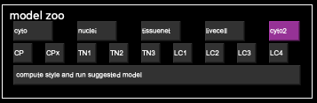
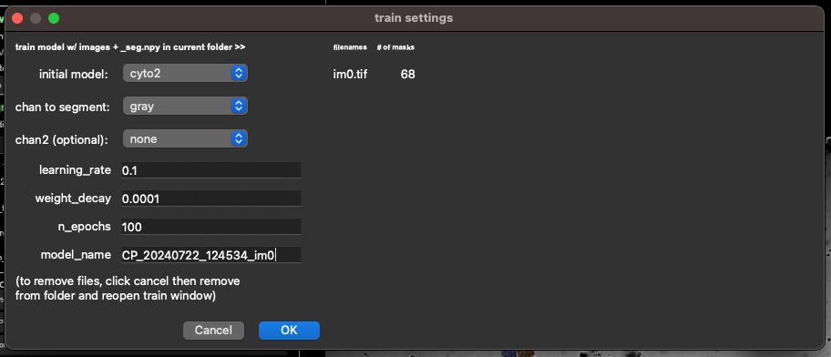
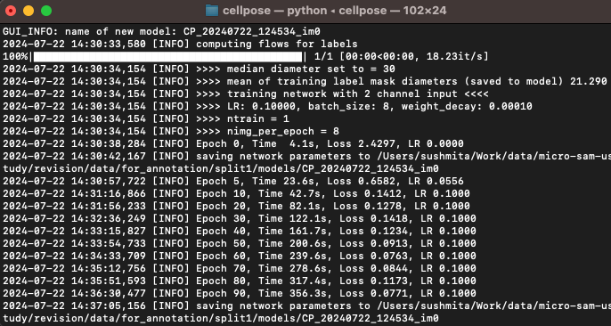

# Updated micro-sam user study


## Annotation Experiments

### Preparation

The data for the user study is stored here: `/scratch-emmy/projects/nim00007/user-study`.
You can copy it to your laptop via:
```
rsync -e "ssh -i <SSH_KEY>" -avz <USER_NAME>@glogin9.hlrn.de:/scratch-emmy/projects/nim00007/user-study/data .
```
And sync your annotation results via: 
```
rsync -e "ssh -i <SSH_KEY>" -avz data <USER_NAME>@glogin9.hlrn.de:/scratch-emmy/projects/nim00007/user-study
```
Enter the location of your ssh key for HLRN in `<SSH_KEY>` (for me: `~/.ssh/id_rsa_hlrn`) and your HLRN username for `USER_NAME` (for me: `nimcpape`).

After syncing the results you still have to change the file permissions on scratch:
- Log into an HLRN node.
- `cd /scratch-emmy/projects/nim00007/user-study/data`
- `chgrp -R nim0007 annotations`

The google sheet for timing results is [here](https://docs.google.com/spreadsheets/d/17-FKwLk__XuZHbUkPveC7OqsW_kBaIt0aBsBp3Lq7VQ/edit?usp=sharing). Enter the times as HH:MM:SS. You can leave out HH if not needed.

To run the annotations with micro_sam use an environemnt with **the latest** micro_sam `master` branch.
See [here](https://computational-cell-analytics.github.io/micro-sam/micro_sam.html#from-source) for instructions how to set up this environment.

To run the annotations with CellPose:
- Clone the cellpose repository from: https://github.com/MouseLand/cellpose
- Create cellpose enviroment using conda with python 3.9: `conda create --name cellpose python=3.9 -c conda-forge`
- Activate the environment: `conda activate cellpose`
- Install **CellPose v2.3.2** using 
    - `python -m pip install cellpose[gui]==2.3.2`
    - OR, if you're using zsh: `python -m pip install 'cellpose[gui]'==2.3.2`
- Open CellPose GUI using: `python -m cellpose`

See [here](https://github.com/MouseLand/cellpose#option-1-installation-instructions-with-conda) for more details on the installation. 

Using CellPose GUI: Information on how to use it is mentioned under relevant experiments. More details can be found [here](https://cellpose.readthedocs.io/en/v1.0.2/gui.html#gui).

### Experiments

1. Manual annotation of images in Split 1:
    - Annotate the organoids individually with napari.
    - Run `python annotate_v1.py` to start napari for the respective images.
    - Measure the time it takes for annotation per image (e.g. using your phone's stopwatch function), and enter it into the corresponding column in the google sheet.
    - Store the results in `data/annotations/v1/<YOUR_NAME>`, e.g. `data/annotations/v1/constantin`.
        - Use `Save Selected Layer ...` in napari to save your annotations. Name each file `im<ID>.tif`. You can find the ID on top of the viewer.
    - You can find an example video [here](https://drive.google.com/file/d/1Dyk9yNisaCUhuOYr-d9H31I14BNIa9ad/view?usp=sharing). The napari annotation fucntionality is explained in more detail [here](https://napari.org/stable/howtos/layers/labels.html). Please note that there is a bit too much debris labeled in the example image. See the [annotation guidelines](#annotation-guidelines) below for details.

2. Segmentation and correction of Split 1 with micro_sam (vit_b)
    - Auto-segment and interactively correct the organoids with micro_sam (default SAM model).
    - Run `python annotate_v2.py <YOUR_NAME>`, e.g. `python annotate_v2.py constantin`. This will start micro_sam for the data.
    - It will first precompute embeddings and AMG State. This will take a while when running the command for the first time. Please note the time it takes in `preprocessing` in the `v2` tab of the spreadsheet. This time will be printed in the terminal.
    - Then annotate each image by first running automatic segmentation and then interactively correcting the result.
    - You don't need to save the annotation result, micro_sam will take care of this for you when you click `Next`.
    - You can find an example video [here](https://drive.google.com/file/d/1NdtHjpxdBp3-1hyTAt1vBZX4FRu9GGp9/view?usp=sharing). The micro_sam annotation functionality is explained in more detail [here](https://computational-cell-analytics.github.io/micro-sam/micro_sam.html#annotator-2d).

3. Segmentation and correction of Split 1 with micro_sam (vit_b_lm)
    - Auto-segment and interactively correct the organoids with micro_sam (our finetuned model).
    - Run `python annotate_v3.py <YOUR_NAME>`, e.g. `python annotate_v3.py constantin`. This will start micro_sam for the data.
    - Proceed as in 2.

4. Segmentation and correction of Split 1 with CellPose:

    Here's a quick start to using CellPose GUI. More information on how to use it can be found [here](https://cellpose.readthedocs.io/en/latest/gui.html)
    - Drag and drop the image you want to segment.
    - Calibrate cell diameter for the first image by clicking `Calibrate` under `Segmentation` in the left pannel. **Start timing** with a stopwatch at this point. You don't need to calibrate the diameter for all subsequent images. Only calibrate if the object sizes are very different from the images seen so far. 
    - Use the model **cyto2** from the model zoo. If you have calibrated the diameter, let the timer continue. If you haven't, **Start timing** as soon as you click on `cyto2`.
    
    - To correct / add annotations:
        - Toggle between mask and no mask views: Select `MASKS ON [X]` under `Drawing` on the left pannel.  
        - Delete a mask: `Ctrl + left click` on selected mask.
        - Create new mask: `Right click + hover mouse on the boundary of object`.
        - After all the corrections to the annoations of the image, record the time taken in the `im<N>` field in the spreadsheet. 
        - Save annotations: `Ctrl + S` to save masks as .npy file. The annotations are saved in the image directory and you will have to move these to `data/annotations/v4/<YOUR_NAME>`.
    - Repeat the steps above for all images in Split 1.

5. Segmentation and correction of Split 2 with micro_sam
    - Same approach as 2., but for the data in split 2.
    - Run `python annotate_v5 <YOUR_NAME>`, proceed as in 2. otherwise.

6. Segmentation and correction of Split 2 with CellPose HIL

    This experiment contains two parts. Part 1 where images in Split 2 are segmented and corrected with the pre-trained cyto2 mode and Part 2 where we use CellPose human-in-the-loop (HIL) to finetune with each image after correcting the annotations. Create `part1` and `part2` folders in `data/annotations/v6/`. 
    #### PART 1
    - Same approach as 4., but for the data in split 2.
    - Move all .npy segmentation files to `data/annotations/v6/part1/<YOUR_NAME>`
    - delete all the .npy segmentation files from the split 2 image directory before Part 2. 

    #### PART 2
    - Drag and drop the first image in split 2 and annotate using steps mentioned in Experiment 4. (measure the time taken to annotate it using `cyto2`)
    - Human-in-the-loop (HIL) feature of CellPose allows for finetuning the `cyto2` model based on user corrected annotations. Only 1 image can be used to finetune at a time. The idea is to use the pre-trained `cyto2` model on the first image -> correct or add masks to achieve desired segmentation quality -> finetune using corrected annotations and save the new model -> use the new model to segment the next image in Split 2. Repeat this cycle until you achieve the desired segmentation results. 
    To use HIL finetuning function of cellpose:
        - Finetune using `Ctrl + T`. This opens the 'train settings' dialogue box. 
        
        - Here change initial model to `cyto2` and add suffix image name `_im<N>` for easy identification of the new model. Click OK. **Start timing** at this point to record training time using the current image. Monitor the completion of training in the terminal and record the time in the speadsheet in row `im<N> training`. You can also find the training time by looking at the training log in the terminal starting from `[INFO] computing flows for labels` to `[INFO] saving network parameters`.
        
        - After training completes, cellpose opens the next image in the directory and annotates automatically with the new model. The new model will be shown under `custom models` in the left pannel. If you notice that the finetuned model annotates significantly fewer masks than your experince with cyto2 in Part 1, you can choose to annotate with `cyto2` from the model zoo and start the timer for the new image (This would be faster than using the finetuned model and adding all the missing segmentations yourself).  
        - Make corrections to the new image and repeat steps.
        - For this experiment we will finetune using all images in Split 2. If no correction needs to be made for an image, run the finetuning as it is and load new image.

7. Segmentation and correction of Split 3 with micro_sam
    - Before running this you need to finetune a model via:
        - `python finetune_sam.py <NAME>`
        - Note: ideally you should run this on your laptop and let it train for a few hours. But if this does not work you can also run it on the cluster and then copy back over the trained model. Please note down the training time in the corresponding google sheet too.
    - Then run `python annotate_v7.py <YOUR_NAME>` and proceed as in 3. otherwise.

8. Segmentation and correction of Split 3 with CellPose
    - Annotate all images using the latest model from Experiment 6. - Choose the latest model `CP_<>_<>_im5` under `custom models` in the left pannel and click run model. 
    - Use the same model for all images in Split 3 and correct annotations just as in Experiment 4. **Here, you do not perform HIL finetuning after each image.**

### Annotation guidelines

The goal is to annotate the organoids in the images. The organoids are generally round structures enclosed by a membrane.
They come in different sizes and the size distribution is often heterogenous in a given image.

In many cases it is not fully clear what is an organoid and what is a small background object or out-of-focus.
These cases are somewhat subjective, try to judge based on the size (too small -> don't annotate) and how in focus an object is (blurry -> don't annotate).

Another case of ambiguity are overlapping organoids. In these cases annotate one of the organoids fully.

The images below show example annotations with some comments for the cases discussed above.


## User study strategy:

New annotations from Sushmita: `/scratch-emmy/projects/nim00007/data/pdo/user_study/user_study_test_labels_2/`
TODO: do another round of proof-reading on top and take care of the remaining three images.

Annotators: Anwai, Caro, Constantin, Luca, Marei, Sushmita

- Cluster images into three categories: large, medium, small organoids, based on initial segmentation.
- Create 3 different splits, each containing at least one image from each of the category
    - Split 1: 3 images, to be annotated with the following approaches:
        1. Manual annotation
        2. Segmentation and correction with micro_sam (vit_b)
        3. Segmentation and correction with micro_sam (vit_b_lm)
        4. Segmentation and correction in CellPose (cyto2)
    - Split 2: 6 images, to be annotated with the following approaches:
        5. micro_sam (same approach as III or IV, what worked better)
        6. CellPose HIL (starting from cyto2)
    - Split 3: 6 images, to be annotated with the following
        7. micro_sam: segmentation + correction (based on model trained on data annotated in VI)
        8. CellPose segmentation + correction (based on model after V)

- Segmentation evaluation:
    - We evaluate CellPose and micro_sam models trained on data from (Split 2) and (Splits 2 and 3) on:
        - On our reference data (some images, with more corrections)
        - On OrganoIDNet data (the 10 images from the test split)

- Time measurements:
    - Measure the annotation times per image.
    - Measure how long processing takes (ideally we add timers to this so that no one has to wait around and actively measure)
        - Embedding and AMG state precomputation for micro-sam
        - Training (CPU + LoRA) for micro_sam
        - Segmentation for CellPose
        - HIL for CellPose


## Data overview

- Annotated reference data:
    - 15 images and masks. 
    - Needs another round of proof-reading!
- Non-annotated data:
    -  25 images without masks.
- External data:
    - OrgaSegment: intestinal organoids. Interesting, but probably too dissimilar from us.
    - OrganoIDNet: from Alves Lab. Further apart from our data then I would have thought. But we can still give it a try.
        - We should see how one of our current networks performs on it.
